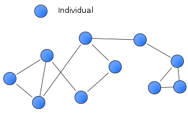
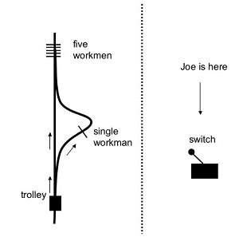

## Plan

- Before Lunch: Project Leads' Presentations
- Lunch Time: Social communication
- After Lunch: Q & A; More communications

## Beginning 

- (You) want to launch a collaborative research project.
- (Your) research interest requires a global examination.
- **(You) have a big plan but require hands.**

## Perspective

<style type="text/css">
.tg  {border-collapse:collapse;border-spacing:0;}
.tg td{font-family:Arial, sans-serif;font-size:14px;padding:10px 5px;border-style:solid;border-width:1px;overflow:hidden;word-break:normal;border-color:black;}
.tg th{font-family:Arial, sans-serif;font-size:14px;font-weight:normal;padding:10px 5px;border-style:solid;border-width:1px;overflow:hidden;word-break:normal;border-color:black;}
.tg .tg-s6z2{text-align:center}
.tg .tg-baqh{text-align:center;vertical-align:top}
</style>
<table class="tg">
  <tr>
    <th class="tg-s6z2" colspan="2">Individual -&gt; Network</th>
    <th class="tg-baqh">Network -&gt; Individual</th>
  </tr>
  <tr>
    <td class="tg-baqh" colspan="2"> <br>Designed by Dooder / Freepik</td>
    <td class="tg-baqh"></td>
  </tr>
</table>

----

```{r echo=FALSE, message=FALSE, warning=FALSE, paged.print=TRUE, fig.width=300}
knitr::include_graphics(path = "./includes/img/Lakens_to_EverythingHertz.png")
```

## Projects

|[](003_project.html)||
|:---:|:---:|
||[](https://osf.io/ypqhb/)|

<!---
- ()
- TRUE BELIEF
- STEREOTYPE THREAT
- []()
--->