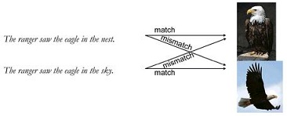
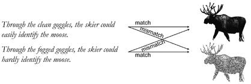
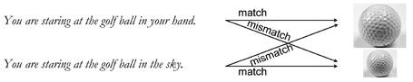
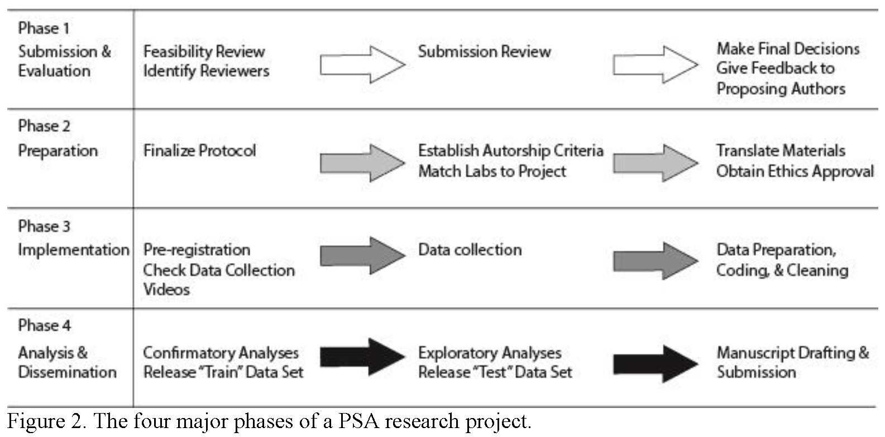

---
output:
  revealjs::revealjs_presentation:
    transition: none
    theme: white
    center: true
    width: "100%"
    height: "100%"
    margin: 0
    minScale: 1
    maxScale: 1
    incremental: true
css: style.css
bibliography: "D:/core/Research/projects/Embodied/EXPDATA/ActionObject/2016_Simulation/report/includes/bib/Orientation.bib"
---

# Simulated Object Orientations in Reading Sentences

## About me

Sau-Chin Chen  
<small>Associative Professor, Department of Human Development and Psychology</small>  
<small>Tzu-Chi University</small>

 <small>Center for Open Science, Ambassador</small> 

<small>Psychological Science Accelerator, Fellow, Assistant Director</small> 
 [<small>scchen.com</small>](http://scchen.com)

  <small>[Fork my slides on Github](https://github.com/SCgeeker/)</small>

# Orientation and Size

## Issues

>- **Mental Simulation**: Our minds simulate what we are reading.
>- **Match Advantage**: Faster responses to the object pictures which are compatible with our simulations.

----

|Properties|Example|Chone's d_z|
|:---:|:---:|---|
|<samll>Shape</small>||.27 ~ .31|
|<small>Color</small>||.20 ~ .48|
|<small>Size</small>||.07 ~ .27|
|<small>Orientation</small>||.07 ~ .13|

<small> Source: @ZwaanRevisitingMentalSimulation2012; @koning_mental_2017; @dekoningSizeDoesMatter2017 </small>

----

### Why the orientation effect has the smallest effect size?

- Intrinsic vs. Extrinsic
- Only small objects were employed in the investigation of orientation effect
- Diversity among languages
- Particular task demand

## Registered Report

----

<iframe class="stretch" data-src="https://psyarxiv.com/a3vwc/"></iframe>

----

### Investigate match advantage of object orientation between ...

- Large objects vs. Small objects: **crane** vs. **cane**
- Tasks: Picture Verification vs. Picture Identification vs. Picture Naming
- Languages: English vs. Dutch(Dutch; English) vs. Chinese

----

### Pre-analysis for sample size estimation

- Estimate maximal sample size in terms of past results and .80 power
- Decide Bayes Factor for stopping data collection

----

## Findings

----

### About picture verification

----

### About picture identification

----

### About picture naming

No language group shows match advantage in picture naming.

## Conclusion

- Orientation effects shifted with object size
- Moderator of languages
- Demands of picture properties

# Orientation effects across languages

## Issue

>- **Language Diversity**: American English shows the robust orientation effect
>- **Embodied Cognition**: Extended studies depended on small effect size

----

>- How would language alter match advantage of object orientation?

## Registered Report

----

<iframe class="stretch" data-src="https://psysciacc.org/"></iframe>

----

<iframe class="stretch" data-src="https://nicholas-coles.shinyapps.io/PSA_Map_Prototype/"></iframe>

----

<small>source: @moshontzPsychologicalScienceAccelerator2018 </small>

## Latest news

----

<iframe class="stretch" data-src="https://psyarxiv.com/t2pjv/"></iframe>

----

# Multi-Site Collaboration

## Advantages (for sciences)

- Investigate **psychological effects** which could be diverse among cultures, langauges, societies, and any human traits.
- Accumulate the reproducible data in science literature.

## Challenges (for local site)

- Limited resource
- Incompatible with current research interest
- Awareness to update members' practices
- Motivation toward open sciences

## Opportunities (for local site)

- Explore new research topics
- Share experience
- Upgrade scientific scope

## Thoughts and Recommendations

- Do what you like
- Improve your standard of research quality
- Think about the global potential of your local study

## Reference
